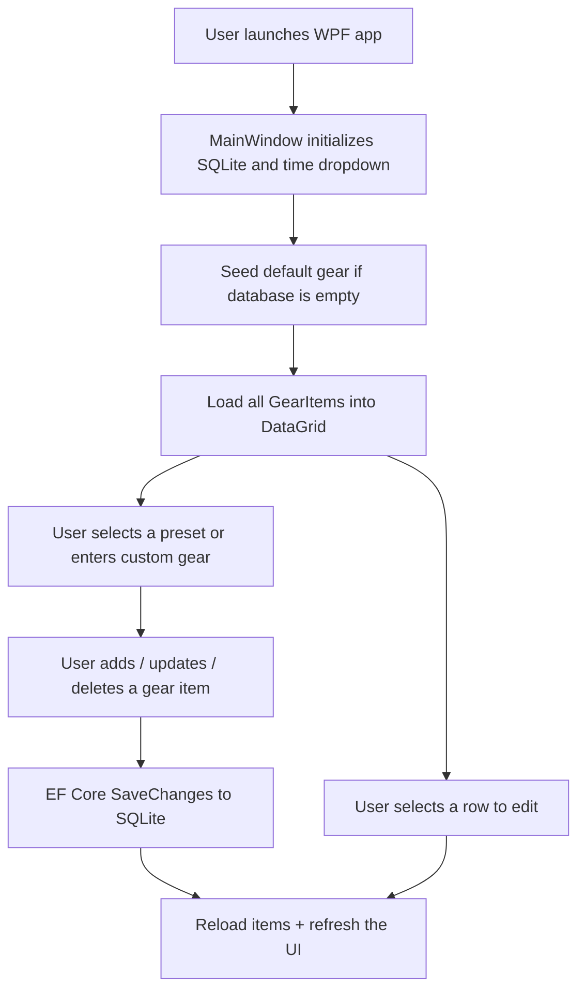
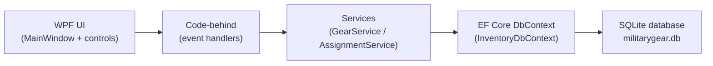

<p align="center">
  
</p>

# 🪖 Military Gear Inventory
### Chicago Tech Assignment – WPF Desktop App • SQLite • EF Core Code First • Army Themed

---

## 🎥 Demo Video (Coming Soon)

A full video demonstration will be added here.

---

## 📖 Project Summary

Military Gear Inventory is a **WPF desktop application** that manages military equipment with full CRUD functionality.  
The focus of this assignment is on **backend skills**: C#, **Entity Framework Core**, **SQLite**, code-first database setup, and basic querying, with a simple Army-themed WPF UI on top.

This project is part of the **Chicago Tech** assignment workflow and uses a clean `Models`, `Data`, and `Services` structure.

---

## ⭐ Core Features

- Full **CRUD operations** for gear inventory items
- **DataGrid** bound to EF Core query results
- **DatePicker + 24-hour time dropdown** for inspection tracking
- SQLite handled through **EF Core**
- Code-first setup with automatic database creation
- Preset gear dropdown for quick demo/testing
- Army-themed colors and layout
- Seed data on first run when the database is empty

> 💡 **Seed Data:**  
> On first run, the app can automatically load starter gear items such as:
> - Tactical Helmet
> - Battle Vest
> - Field Radio
> - Night Vision Goggles
> - Combat Boots
> - Camouflage Uniform
> - Medical Kit
> - Ammo Pouch

---

## 🔄 App Workflow (High Level)



---

## 🧱 Tech Stack

- **Language:** C#
- **Framework:** .NET 8 (WPF)
- **UI:** WPF (XAML + code-behind)
- **ORM:** Entity Framework Core
- **Database:** SQLite
- **Patterns:** Services, code-first, basic LINQ querying

WPF is used as a **front-end shell**, while the assignment focus is on CRUD, EF Core, and SQLite logic.

---

## 🗂️ Folder Structure

```text
Rovy Assignment 11.1/
├── Rovy Assignment 11.1.sln
├── README.md
├── .gitignore
├── assets/
│   └── copilot-image-231072.png
└── Rovy Assignment 11.1/
    ├── App.xaml
    ├── App.xaml.cs
    ├── MainWindow.xaml
    ├── MainWindow.xaml.cs          // event handlers + CRUD + preset selection
    ├── Data/
    │   └── InventoryDbContext.cs    // EF Core DbContext
    ├── Models/
    │   └── GearItem.cs             // entity model for EF Core
    └── Services/
        ├── AssignmentService.cs    // seed/preset gear logic
        └── GearService.cs          // CRUD logic
```

---

## 🧩 Architecture Overview



- The **WPF UI** (XAML + code-behind) handles buttons, text boxes, DatePicker, ComboBox, and DataGrid.
- The **services** keep CRUD and seed logic out of the UI.
- **EF Core** maps the `GearItem` model to the SQLite database using code-first conventions.

---

## 🗃️ Database Model Example

### InventoryDbContext

```csharp
using Microsoft.EntityFrameworkCore;
using MilitaryGearInventory.Models;

namespace MilitaryGearInventory.Data;

public class InventoryDbContext : DbContext
{
    public DbSet<GearItem> GearItems => Set<GearItem>();

    protected override void OnConfiguring(DbContextOptionsBuilder optionsBuilder)
    {
        if (!optionsBuilder.IsConfigured)
        {
            optionsBuilder.UseSqlite("Data Source=militarygear.db");
        }
    }
}
```

### GearItem Entity

```csharp
using System.ComponentModel.DataAnnotations;

namespace MilitaryGearInventory.Models;

public class GearItem
{
    [Key]
    public int Id { get; set; }
    public string GearName { get; set; } = string.Empty;
    public string Category { get; set; } = string.Empty;
    public string? Brand { get; set; }
    public int Quantity { get; set; }
    public string? Condition { get; set; }
    public string? Location { get; set; }
    public DateTime? LastInspectionDate { get; set; }
    public string? Notes { get; set; }
}
```

EF Core maps this class into a `GearItems` table with `Id` as the primary key, plus the additional fields for inventory metadata.

---

## 💻 Sample CRUD and Preset Logic (MainWindow.xaml.cs)

### Startup and Seed Logic

```csharp
public MainWindow()
{
    InitializeComponent();

    PopulateInspectionTimeDropdown();
    LoadGearPresets();
    SetDefaultInspectionDateTime();

    _gearService.InitializeDatabase();
    SeedSampleDataIfNeeded();
    LoadGearItems();
}
```

### Preset Gear Dropdown

```csharp
private void GearPreset_SelectionChanged(object sender, SelectionChangedEventArgs e)
{
    if (cbGearPreset.SelectedItem is not GearItem preset)
    {
        return;
    }

    txtGearName.Text = preset.GearName;
    txtCategory.Text = preset.Category;
    txtBrand.Text = preset.Brand ?? string.Empty;
    txtQuantity.Text = preset.Quantity.ToString();
    txtCondition.Text = preset.Condition ?? string.Empty;
    txtLocation.Text = preset.Location ?? string.Empty;
    txtNotes.Text = preset.Notes ?? string.Empty;
}
```

### Add

```csharp
private void Add_Click(object sender, RoutedEventArgs e)
{
    var gearItem = BuildGearItemFromForm(includeId: false);
    if (gearItem is null) return;

    _gearService.AddGearItem(gearItem);
    LoadGearItems();
    ClearForm();
}
```

### Update

```csharp
private void Update_Click(object sender, RoutedEventArgs e)
{
    if (_selectedGearItem is null) return;

    var gearItem = BuildGearItemFromForm(includeId: true);
    if (gearItem is null) return;

    _gearService.UpdateGearItem(gearItem);
    LoadGearItems();
    ClearForm();
}
```

### Delete

```csharp
private void Delete_Click(object sender, RoutedEventArgs e)
{
    if (_selectedGearItem is null) return;

    _gearService.DeleteGearItem(_selectedGearItem.Id);
    LoadGearItems();
    ClearForm();
}
```

---

## 🚀 How to Run

1. Open the solution in **Visual Studio**.
2. Restore NuGet packages for **EF Core** and the **SQLite** provider.
3. Build the project.
4. Press **F5** to run the application.

On first run, the app seeds default gear items if the database is empty.

---

## 📌 Future Improvements

- Add a **search** box for gear name/category filtering
- Add validation summaries for form errors
- Add export to CSV
- Add image support for gear records
- Switch to full MVVM if needed later

---

## 👨‍💻 Author

**Bobby Rovy**  
Chicago Tech Assignment  
Army-themed WPF + SQLite project
